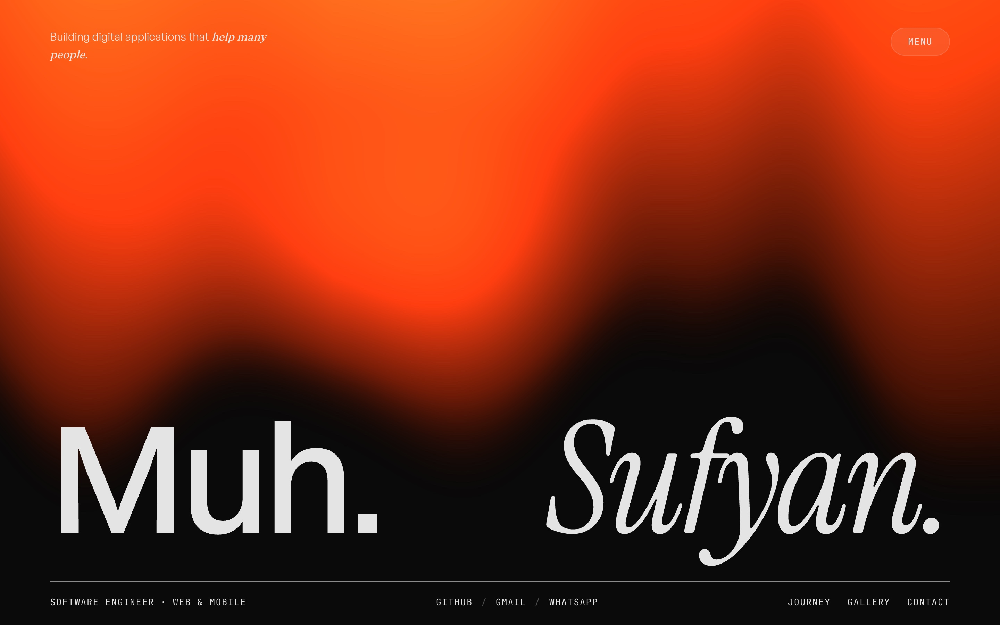

# Portfolio Redesign — Muhammad Sufyan

Motion-first, scroll-telling single-page portfolio of **Muhammad Sufyan** — a software engineer (Indonesia) working across web and mobile.



The site is told as one continuous, chaptered narrative with GSAP/Lenis-driven choreography — reference feel: [lukebaffait.fr](https://lukebaffait.fr) (motion and polish only, not its content). Dark-only, near-black canvas, a single surgical ember accent.

> **Build status (2026-07-19):** foundation + chapters **00–03** are shipped on the **10-chapter map** — `00 Preloader · 01 Hero · 02 Manifesto · 03 About · 04 Project/Craft · 05 Journey · 06 Skills · 07 Gallery · 08 Contact · Footer` (PLAN v3.1 §0). As built: **name-as-shared-element morph preloader** (wordmark char-cascade + loading gate → FLIP morph onto the hero name under an ember→ink two-sheet bottom-up wipe, atomic cut at full cover; runs every load, tunables in `src/utils/preloader.tunables.ts`), **aurora hero** (ogl) with the one-line `Muh. Sufyan.` name, **WebGL MacBook manifesto** (R3F island — center-born entry, zoom-slide expansion, seam-blended into About), **reference-exact About** (staged reveals, odometer ignition stat cards in glass chrome, CV blur reveal, ember-duotone portrait with glare hover). Remaining: **04 Craft → 08 Contact + Footer** (PLAN v3.1 §7 order) + `src/lib/emailjs.ts` (lands with 08). Deferred to final QA: scroll-spy nav dot, bundle split, favicon/OG. The redesign is fully specified in [`.agents/context/`](.agents/context/) + `PLAN.md` and built chapter by chapter — one approval gate per section — through the agent workflow in [AGENTS.md](AGENTS.md).

## Chapters

The page reads as a single vertical narrative, built one chapter at a time (each behind its own approval gate):

| # | Chapter | Content | Status |
| --- | --- | --- | --- |
| 00 | **Preloader** | wordmark char-cascade + loading gate → FLIP name-morph onto the hero heading under an ember→ink two-sheet bottom-up wipe, atomic cut at ink full-cover (runs every load) | ✅ built |
| 01 | **Hero** | one-line `Muh. Sufyan.` display name — Switzer upright lead + Instrument Serif italic tail — over the ogl aurora, role line, hairline chrome bar (role · channels · anchors) | ✅ built |
| 02 | **Manifesto** | WebGL MacBook scroll story (R3F island, DRACO-compressed GLB) — center-born entry, zoom-slide slow expansion, statement with ember focal word, seam blend into About | ✅ built |
| 03 | **About** | persona statement with italic focal phrases, staged bio reveals, odometer ignition stat cards in glass chrome (Instrument Serif numerals), CV blur reveal, ember-duotone portrait with glare hover | ✅ built |
| 04 | **Project/Craft** | Web/Mobile pillars + keyword marquee + hover-swap index of all 6 projects | ⏳ next |
| 05 | **Journey** | one timeline merging work experience, education, and awards (9 items) | ⏳ pending |
| 06 | **Skills** | positioning statement + scroll-driven category accordion (21 skills) | ⏳ pending |
| 07 | **Gallery** | the 5 featured projects as WorkCards (clip reveals, parallax) | ⏳ pending |
| 08 | **Contact** | the light-invert section — magnetic CTA + EmailJS form (WhatsApp · Gmail · Telegram) | ⏳ pending |
| — | **Footer** | name marquee bookend, mono meta columns | ⏳ pending |

## Stack

| Tool | Role |
| --- | --- |
| **React 19** + **TypeScript (strict)** | UI, no `any`, functional components |
| **Vite 7** | dev server + build |
| **TanStack Router** | file-based routing, registry-only route files, auto code-splitting |
| **Tailwind CSS v4** | styling — CSS-first (`@theme` tokens in `src/styles/globals.css`, no `tailwind.config`) |
| **shadcn/ui** | primitives (new-york style, neutral base, lucide icons) — currently `button`, `tooltip` |
| **GSAP** + ScrollTrigger (`@gsap/react`) | scroll-driven animation, single source in `src/lib/gsap.ts` |
| **Lenis** | smooth scroll, one owner in `src/providers/SmoothScrollProvider.tsx` (lerp 0.09) |
| **three** + **@react-three/fiber** + **drei** | the manifesto MacBook 3D island (`public/models/macbook.glb`, DRACO-decoded) |
| **ogl** | lightweight WebGL aurora background in the hero |
| **split-type** | per-character / per-line text reveals |
| **zustand** | minimal UI store (`preloaderDone`, `menuOpen`) |
| **EmailJS** (`@emailjs/browser`) + react-hook-form | contact form submission, no backend (wired at chapter 08) |
| Switzer · Instrument Serif · Fraunces · General Sans · JetBrains Mono | self-hosted faces — hero name pairing · display · body/UI · labels |
| `clsx` · `tailwind-merge` · `cva` | class merging (`cn()`) + variants |

## Getting started

```bash
npm install
npm run dev        # start the Vite dev server
```

| Script | What it does |
| --- | --- |
| `npm run dev` | Vite dev server with HMR |
| `npm run build` | typecheck (`tsc -b`) then production build |
| `npm run lint` | ESLint (flat config, `eslint.config.js`) |
| `npm run preview` | preview a production build locally |
| `npm run capture:ref` | dev tooling — re-capture stills of the motion-reference site into `reference/` |
| `npx tsc --noEmit` | typecheck only, no build |

No test framework is configured — there are no tests and no test command.

## Environment

There is no backend. The contact form talks to **EmailJS** directly from the client. Create a `.env` in the project root (it is gitignored) with your EmailJS keys — used once the contact chapter (08) is built:

```bash
VITE_EMAILJS_SERVICE_ID=...
VITE_EMAILJS_TEMPLATE_ID=...
VITE_EMAILJS_PUBLIC_KEY=...
```

Keys are read through `src/config/env.ts`; nothing else touches `import.meta.env`.

## Design language

- **Palette — "Void & Ember" (`design_system.md` v2, live)**: neutral near-black `#0A0A0A` background, neutral paper `#E4E4E4` text, one vivid **ember accent `#E8380F`** used surgically — evidence-sampled from the reference site and applied in `src/styles/globals.css` since 2026-07-07. Components style by token *name*, never raw hex. Brass `#C8A46A` and cobalt `#3B5BFF` remain unchosen documented alternates.
- **Typography** — the hero name pairs **Switzer** (upright lead) with **Instrument Serif italic** (tail) via the `--font-display-lead` / `--font-display-tail` tokens (woff2s in `public/fonts/`, preloaded in `index.html`). **Fraunces** carries display/chapter titles, **General Sans** body and UI, **JetBrains Mono** chapter numbers, eyebrows, and labels — all bundled/self-hosted (`@fontsource` + `src/assets/fonts/`).
- **Motion** — GSAP + ScrollTrigger on a Lenis canvas; every effect runs in `useGSAP` with a `prefers-reduced-motion` fallback (opacity-only, Lenis off, cursor hidden). Choreography knobs live in tunables files (`src/utils/preloader.tunables.ts`, `src/features/home/utils/hero.tunables.ts`) rather than magic numbers.
- **Three golden rules** (`system_architecture.md`): feature isolation (no `src/features/*` imports another feature) · one GSAP source (`src/lib/gsap.ts`) · one Lenis owner (`SmoothScrollProvider`).

Full palette, type scale, tokens, per-chapter choreography, and the vetted reference component libraries (§7.5): [`.agents/context/design_system.md`](.agents/context/design_system.md).

## Component primitives

Feature, page, and section code never emits raw HTML wrappers — it uses the polymorphic primitives from `@/components/common`:

| Raw element | Use instead |
| --- | --- |
| `div`, `section`, `article`, `header`, `footer`, `nav`, `ul`, `li` | `<Box as="section">` |
| centered max-width wrapper | `<Container maxWidth="7xl">` |
| `p`, `span` | `<Text as="p" variant="default">` |
| `h1`–`h6` | `<Heading level={2}>` |
| `a` / router link | `<Link href="/x">` (internal · hash smooth-scroll via Lenis · external/mailto/tel) |
| `img` | `<Image src alt width height />` (lazy + skeleton + fallback) |

The same barrel ships the **motion primitives** — `RevealText`, `ParallaxImage`, `Marquee`, `MagneticButton`, `ChapterEyebrow`, `Cursor`, `Preloader`, `PathDraw` — all GSAP-scoped with reduced-motion fallbacks built in.

```tsx
import { Box, Heading, Text } from "@/components/common";

<Box as="section" className="py-24">
  <Heading level={2} variant="display">Selected Work</Heading>
  <Text as="p" variant="lead">A few things I've built.</Text>
</Box>
```

Interactive controls (buttons, inputs, dialogs) use shadcn/ui, not raw elements. Full mapping, real prop surfaces, and gotchas: [`.claude/output-styles/custom-components.md`](.claude/output-styles/custom-components.md) and [`.claude/rules/custom-components.md`](.claude/rules/custom-components.md).

## Project structure

```text
public/
├── assets/images/profile/  # About portrait photo
├── draco/                  # DRACO decoder for the MacBook GLB
├── fonts/                  # self-hosted Switzer + Instrument Serif (hero name pairing)
└── models/                 # macbook.glb (+ rigged variant) for the manifesto story
src/
├── assets/fonts/           # self-hosted General Sans variable woff2
├── components/
│   ├── common/             # Box, Container, Text, Heading, Link, Image +
│   │                       # motion primitives (RevealText, ParallaxImage, Marquee,
│   │                       # MagneticButton, ChapterEyebrow, Cursor, Preloader, PathDraw)
│   ├── layouts/            # RootLayout (the one true route layout)
│   ├── shared/             # MenuButton, MenuPopout (z-60), SiteMenu (z-80)
│   └── ui/                 # shadcn/ui generated primitives (button, tooltip)
├── config/                 # site.ts (SEO/meta), env.ts (EmailJS keys)
├── constants/              # navigation.constant.ts
├── data/                   # projects.data.ts (shared across features)
├── features/
│   └── home/               # the portfolio page — pages/HomePage.tsx,
│                           # sections/{Hero,Manifesto,About}Section.tsx,
│                           # components/AuroraBackground.tsx + manifesto-3d/ (R3F island),
│                           # data/{profile,skills,journey,contact}.data.ts,
│                           # utils/{hero.tunables,channels}.ts
├── hooks/                  # useLenis, usePrefersReducedMotion, useIsomorphicLayoutEffect
├── lib/                    # gsap.ts (single GSAP source), utils.ts (cn) — emailjs.ts joins at ch. 08
├── providers/              # AppProviders, SmoothScrollProvider (single Lenis), ThemeProvider
├── routes/                 # TanStack Router registry files only (no JSX): __root.tsx, index.tsx
├── routeTree.gen.ts        # auto-generated by the router plugin — do not edit
├── store/                  # useUIStore.ts (zustand: preloaderDone, menuOpen)
├── styles/globals.css      # Tailwind v4 entry + @theme design tokens (fonts, colors, type scale, motion)
├── types/                  # portfolio.ts (content contract), motion.ts
├── utils/                  # preloader.tunables.ts (preloader choreography knobs)
└── main.tsx                # entry: StrictMode → AppProviders → RouterProvider
reference/                  # motion-reference capture + frame-extraction tooling (heavy outputs gitignored)
docs/screenshots/           # README imagery (hero.jpg)
```

## Docs & workflow

- **[CLAUDE.md](CLAUDE.md)** / **[GEMINI.md](GEMINI.md)** — project context, conventions, and architecture for Claude Code / Gemini CLI.
- **[AGENTS.md](AGENTS.md)** — the agent roster (@pm · @frontend · @motion · @qa), the plan → approve → build-per-section → QA workflow, and the full skills/commands/MCP inventory.
- **[`.agents/context/`](.agents/context/)** — the authoritative deep specs: [`product_requirements.md`](.agents/context/product_requirements.md) (the *only* content source — facts are transcribed, never invented), [`design_system.md`](.agents/context/design_system.md) (v2, "Void & Ember"), [`system_architecture.md`](.agents/context/system_architecture.md).
- **`logs/feature-changes/`** — committed per-change history (setup → each shipped chapter and refinement).

## Author

**Muhammad Sufyan** — software engineer · web & mobile.
GitHub: [Muhammad-Sufyan-901](https://github.com/Muhammad-Sufyan-901)
